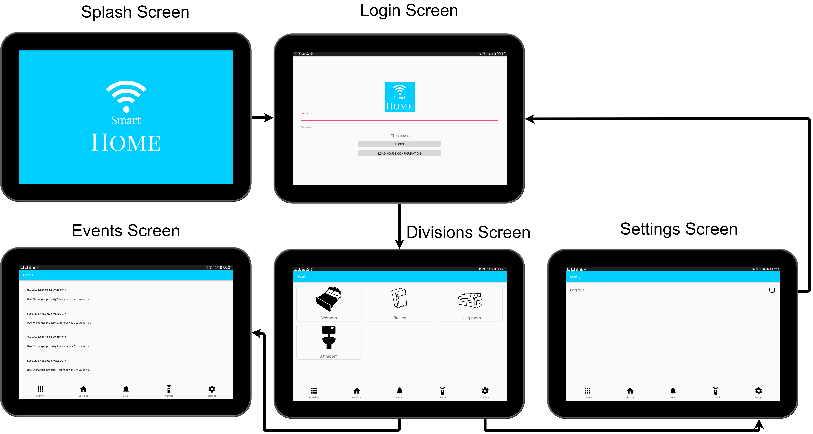

# Smart Home Project
Android application to control a Smart Home, that receives data from a Central HTTP Server. 
Developed for Ambient Intelligence course.

- A house configuration, is specificated in a XML file _basic_config_1.xml_ according to DomoBus Specification. (http://www.domobus.net/)

### Modules:
- **app** - all code related to the android app; dependency on :commonLib
- **server** - all code related to the server; dependency on :commonLib
- **commonlib** - contains all common classes like XML parser & entities for Domo Bus configuration file

### Libraries:
- [ButterKnife](https://github.com/JakeWharton/butterknife) - to bind views easily 
- [Retrofit](https://github.com/square/retrofit) - to call web requests
- [GSON](https://github.com/google/gson) -  to convert Java Objects into their JSON representation and vice-versa

## Android App
- Minimum version: 4.4 KitKat
- MinSdkVersion: 19
- Used Model-View-Presenter (MVP) pattern inspired by [googlesamples](https://github.com/googlesamples/android-architecture/tree/todo-mvp) example
- Used [Material Design](https://material.io/) icons
- Used vector images for divisions and devices from [Pixabay](https://pixabay.com/) and [Canva](https://www.canva.com/) for logo

## Server
- **URL:** http://\<IP address\>:9000/
- Implemented in Java
- Returns objects in JSON format
- Reads devices' initial values from _initial_values.json_

### Server API:
- GET /devices
- GET /divisions/{id}/devices
- GET /devices/{id}

## Wireframe:

